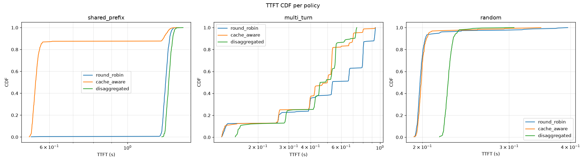
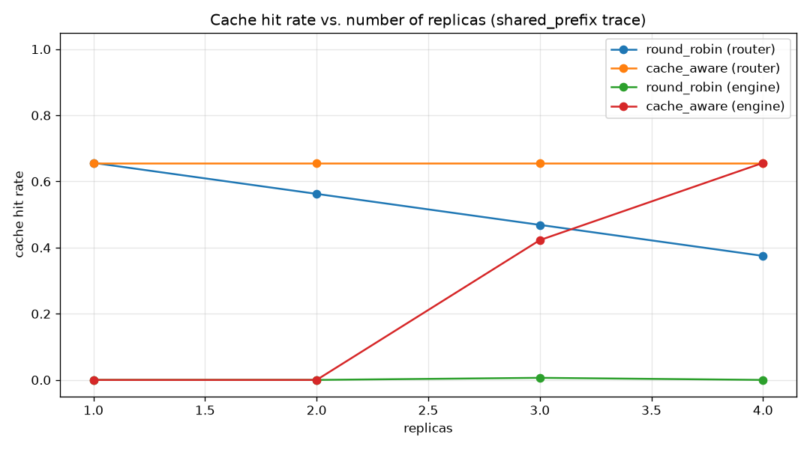

# kvrouters

**A KV-cache-aware inference router for distributed LLM serving, in Rust with a Python SDK.**

Round-robin load balancers destroy prefix-cache locality. When an
OpenAI-compatible gateway spreads requests evenly across vLLM or SGLang
replicas, every replica ends up pre-filling the same long system prompts —
the RAG corpus preamble, the agent tool-schema, the fixed few-shot examples —
over and over. Each redundant prefill costs time-to-first-token on the
critical path and burns GPU compute that could have gone to decoding.
`kvrouters` sits in front of the replicas, remembers (per worker) which prompt
prefixes it has routed where, and scores each candidate worker by
`cache_hit_blocks × cache_weight − in_flight × load_weight` before proxying the
request. The result is measured, not assumed: on a shared-prefix workload the
router cuts p50 TTFT by **2.3×** versus round-robin, and on a random-prefix
control workload it honestly shows no win — documented below.

```mermaid
flowchart LR
    C[Client] -->|OpenAI API, SSE| R[Router<br/>axum + tokio]
    R --> PI[(Prefix index<br/>sharded, TTL + LRU)]
    R -->|prefill phase| P[Prefill pool<br/>vLLM / SGLang]
    R -->|KV transfer| KV[KvTransfer<br/>mock or NIXL]
    KV --> D[Decode pool]
    R -->|proxied stream| D
    C -.->|decoded tokens| R
    R --> M[metrics crate]
    M --> PM[/metrics<br/>Prometheus]
    R -->|health + engine metric scrape| P
    R -->|health + engine metric scrape| D
    K8s[Kubernetes<br/>EndpointSlices] -.->|worker discovery| R
```

## Benchmark results

Reproduced with `python bench/ab.py` (see [`docs/BENCHMARKS.md`](docs/BENCHMARKS.md)
for the full methodology and reproduction commands).

**Configuration:** Apple Silicon MacBook Pro (M-series), Docker Desktop,
`mock_vllm` backends (no GPU — TTFT is simulated with prefill-proportional
latency), 4 replicas with an 80-block engine cache, seeded traces
(`shared_prefix` / `multi_turn` / `random`), Poisson arrivals at 8 req/s,
32 tokens per response, cold caches per run.

| shape | policy | hit rate (router) | hit rate (engine) | ttft p50 | ttft p95 | e2e p50 | e2e p95 |
|---|---|---|---|---|---|---|---|
| shared_prefix | round_robin | 0.375 | 0.003 | 1.282s | 1.326s | 2.317s | 2.368s |
| shared_prefix | **cache_aware** | **0.656** | **0.656** | **0.548s** | 1.292s | **1.585s** | 2.340s |
| shared_prefix | disaggregated | 0.656 | 0.000 | 1.307s | 1.352s | 2.349s | 2.409s |
| multi_turn | round_robin | 0.070 | 0.046 | 0.534s | 0.936s | 1.586s | 1.973s |
| multi_turn | cache_aware | 0.299 | 0.218 | 0.499s | **0.712s** | 1.524s | 1.758s |
| multi_turn | disaggregated | 0.325 | 0.241 | **0.454s** | 0.728s | 1.507s | 1.757s |
| random | round_robin | 0.000 | 0.000 | 0.198s | 0.217s | 1.249s | 1.326s |
| random | cache_aware | 0.000 | 0.000 | 0.199s | 0.206s | 1.258s | 1.305s |
| random | disaggregated | 0.000 | 0.000 | 0.226s | 0.235s | 1.291s | 1.338s |

TTFT CDF per policy (one subplot per workload shape):





Two columns deserve a moment. *Hit rate (router)* is the router's belief index:
round-robin shows 0.375 on `shared_prefix` only because every 4th revisit
cycles back onto the same replica — but *hit rate (engine)* is the engine's
own LRU truth, and there round-robin collapses to 0.003. The gap between the
two columns **is** the product: the engine metric exposes what the router's
belief cannot see, and it is surfaced per-worker in production as
`kvrouter_hit_rate_prediction_error`.

### When this does NOT help

Be honest about the boundaries:

- **Random prefixes.** There is nothing to cache, so cache-aware routing shows
  no win on the `random` trace (0.199s vs 0.198s p50 TTFT — identical, as it
  must be). If your traffic has no prefix reuse, use round-robin and save the
  index bookkeeping.
- **Load imbalance is the price of affinity.** A pure cache-affinity router
  hot-spots: the first request for a prefix lands somewhere, every later
  request scores that worker higher, and the feedback loop pins the workload
  to one engine while the others idle. The `load_weight` term prices
  concurrency back in, but it is a dial, not a proof — too low and you
  hot-spot, too high and you forfeit the cache. Tune it with
  `kvrouters_sdk.simulate()` against *your* traces before deploying.
- **Small engine caches.** If the engine's own KV cache evicts prefixes
  faster than your request mix revisits them, the router's belief index stays
  optimistic and routes "hits" that are actually misses. Watch
  `kvrouter_hit_rate_prediction_error`; it bounds exactly this.

## Quickstart

Three commands to a working request (Docker required):

```bash
docker compose up -d --build     # 4 mock workers + router (+ Prometheus/Grafana)
curl -s http://127.0.0.1:18081/ready   # cache-aware router on 18081
curl -s http://127.0.0.1:18081/v1/chat/completions \
  -H 'Content-Type: application/json' \
  -d '{"model":"mock-vllm","messages":[{"role":"user","content":"Explain prefix caching"}],"max_tokens":16}'
```

Three routers come up, one per policy: round-robin on `:18080`, cache-aware
on `:18081`, disaggregated on `:18082`. Prometheus is on `:19090`, Grafana
(with a provisioned dashboard) on `:13000`. The mocks simulate prefill
latency and prefix hits without a GPU.

Prefer real engines? See [`deploy/vllm/`](deploy/vllm/) and
[`deploy/sglang/`](deploy/sglang/), and enable `metrics_scrape: true` in the
router config to surface the predicted-vs-actual hit-rate gap. Kubernetes
manifests (with live worker discovery) live in [`deploy/k8s/`](deploy/k8s/).

## Design decisions

**Why chain hashing over a radix tree.** The router needs to answer "which
worker has the longest prefix of prompt P cached?" in microseconds, in Rust,
without a tokenizer dependency. A rolling chain hash (`h_i = hash(h_{i-1} ‖
block_i)`) over 512-character blocks turns that question into `k` hash-map
lookups and makes the invariant explicit: two prompts share their first k
KV-blocks exactly when their first k chain hashes match. A radix tree would
buy *suffix* queries (which prompt does this block belong to?) and
order-statistics (LRU ranking by tree position) — useful for a
capacity-aware index that mirrors engine eviction, and for the shared,
Redis-backed index on the roadmap. It would cost implementation complexity
and serialization work that the current belief index doesn't need.

**Why sharded locks over lock-free structures.** The index is read and
written on every request. A single `RwLock<HashMap>` would contend under
concurrency; 64 shards (`hash & 63`) spread that contention by an order of
magnitude beyond realistic worker counts, and every operation holds at most
one shard lock, so deadlock is structurally impossible. A lock-free
concurrent hash map would be faster at high thread counts, but the index is
not the bottleneck — a proxied request spends milliseconds on the network
for every microsecond in the index. The sharded `RwLock` is auditable,
obviously correct, and easy to reason about under the eviction task.

**Why the index is advisory and tolerates staleness.** The router's belief
"worker W holds blocks 0..k of P" can be wrong in two directions: the engine
may evict the blocks (memory pressure) while the router still credits them, or
traffic may arrive outside the router (pre-populating caches the router
hasn't seen). Both directions mis-route — a request pays a prefill it could
have avoided — but neither can produce a wrong answer, only a slower one.
That asymmetry is the design's safety margin: the index is a performance
hint, TTL + LRU + purge-on-worker-death keep it bounded, and
`kvrouter_hit_rate_prediction_error` makes the staleness observable.

**What changes if the KV transfer is real.** Today's disaggregated flow runs
a `KvTransfer` trait with a mock implementation that sleeps
`kv_transfer_cost_ms`. A real connector (NIXL-style RDMA or a shared-memory
channel) changes the latency math — transfer time moves from tens of
milliseconds to sub-millisecond — which flips the disaggregation economics:
with cheap transfer, the prefill pool can specialize (long prompts, high KV
write bandwidth) and the decode pool can scale independently, and
cache-aware selection *within each pool* becomes the differentiator. The
trait seam already exists; the missing pieces are a vLLM-side block-table
handoff (which blocks live where) and backpressure on the transfer queue —
see [`docs/ROADMAP.md`](docs/ROADMAP.md).

## Repository layout

| Path | What it is |
|---|---|
| `crates/router-core` | Routing logic, prefix index, worker registry (no I/O deps) |
| `crates/router-server` | axum HTTP server: OpenAI API, metrics, health, discovery |
| `crates/router-py` | PyO3 bindings (`kvrouters`), built with maturin |
| `python/kvrouters_sdk` | Async client + in-process `simulate()` |
| `bench/` | Seeded trace generator, runner, A/B driver |
| `mocks/` | FastAPI fake vLLM with a block-based prefix LRU |
| `deploy/k8s`, `deploy/vllm`, `deploy/sglang` | Kubernetes, vLLM, SGLang deployment |
| `docs/` | [Architecture](docs/ARCHITECTURE.md), [benchmarks](docs/BENCHMARKS.md), [roadmap](docs/ROADMAP.md), [upstream](docs/UPSTREAM.md) |

See [CONTRIBUTING.md](CONTRIBUTING.md) for the development workflow.
Licensed under [Apache-2.0](LICENSE).
